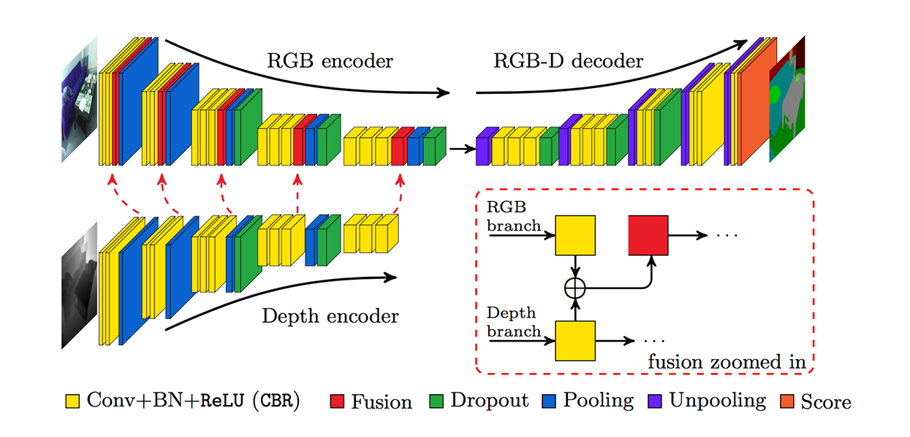

# FuseNet
Code for reproducing main results in the paper [FuseNet: FuseNet: incorporating depth into semantic segmentation via fusion-based CNN architecture](https://vision.in.tum.de/_media/spezial/bib/hazirbasma2016fusenet.pdf) in addition to segmentation a classification loss for scene (kitchen, office,..) is also added to test its effect on the overall segmentation quality.




### Dependencies
Due to the fact that tensorflow doesn't have unpooling layer a work around is done using
maxpool with args which only works on GPU.
- python 2.7
- [TensorFlow 0.12 GPU version](https://www.tensorflow.org/get_started/os_setup)
- In addition, please `pip install -r requirements.txt` to install the following packages:
    - `Pillow`
    - `h5py`
    - `joblib`
    - `scipy`
    - `wget`

### Data
1. Download NYUv2 RGB-D dataset [here](http://cs.nyu.edu/~silberman/datasets/nyu_depth_v2.html). This dataset contains 1449 paired RGB-D images. To map the original labels into 40 classes, we use the mapping by Gupta et al from this [paper](https://people.eecs.berkeley.edu/~sgupta/pdf/GuptaArbelaezMalikCVPR13.pdf). For your convenience, we put the data split and label mapping in the subfolders `Raw/`.
    ```
    nyuv2_40_annots_mapping.mat      maps to 40 annotations, 0 is invalid
    nyuv2_10_class_mapping.mat       maps to 10 classes (scenes), 0 is invalid
    annotations_names.txt            mapped annotations names (indexed according to mapping)
    class_names.txt                  mapped classes (scenes) names (indexed according to mapping)
    splits.mat                       standard train-test split
    ```

2. Preprocess raw dataset and save results to `Datasets/NYU` using

    ```
    python data/nyu_dataset_extract.py -i nyu_dataset.mat -s splits.mat -a annot_mapping.mat -c class_mapping.mat -cn class_names.txt -o Datasets/NYU
    ```

3. Convert extracted dataset to tfrecords `Datasets/NYU/tfrecords` using

   ```
  python data/dataset_to_tfrecords.py --train_dir NYU/train --test_dir NYU/test --output_dir NYU/tfrecords --classes_file class_names.txt
  ```

4. Or simply download processed data with 40 annotations and 10 classes here: [training](https://transfer.sh/UYQx3/tfrecords-train-40-10.tar.gz), [testing](https://transfer.sh/9a72G/tfrecords-test-40-10.tar.gz). Also when running fusenet_train.py it automatically downloads training and test data if not found. When running fusenet_eval.py it automatically downloads test data if not found.

Note: There is a problem with `00222_depth.png` that it is flipped horizontally. Make sure to flip it back before building the tfRecords. The file is fixed in the uploaded tfRecords.


### Training
- To train Fusenet run `fusenet_train` passing tfrecords dir
   
    ```
    python fusenet_train.py and pass in the paramters
    ```

    To use VGG weights download converted caffe model [here vgg16.npy](https://dl.dropboxusercontent.com/u/50333326/vgg16.npy) and link it as follow:

    ```
    python fusenet_train.py --vgg_path vgg16.npy and pass in the rest of the paramters
    ```
    Note: Depth layers weights will also be initialized with their vgg16 equivalent layers. However, for 'conv1_1' the weights will be averaged to fit one channel depth input (3, 3, 3, 64) -> (3, 3, 1, 64)

### Evaluation
- To evaluate Fusenet run `fusenet_eval` passing tfrecords dir

    ```
    python fusenet_eval.py and pass in the paramters
    ```


### To-Do
- [x] Group scene classes (27) to have a good distribition since some classes only have 4 images
- [x] Adjust nyu_extractor to use scene class mapping as well (after grouping)
- [x] Add Weight decay to training
- [x] Add decay rate to learning (multiply by 0.9 in every 50,000 iterations)
- [x] Use Weights initalization from VGG-16
- [x] Add Accuray measurement for evalution
- [ ] Add `fusenet/fusenet_eval.py` to evalute and visualize prediction

### Citing FuseNet
Caner Hazirbas, Lingni Ma, Csaba Domokos and Daniel Cremers, _"FuseNet: Incorporating Depth into Semantic Segmentation via Fusion-based CNN Architecture"_, in proceedings of the 13th Asian Conference on Computer Vision, 2016. ([pdf](https://vision.in.tum.de/_media/spezial/bib/hazirbasma2016fusenet.pdf))

    @inproceedings{fusenet2016accv,
     author    = "C. Hazirbas and L. Ma and C. Domokos and D. Cremers",
     title     = "FuseNet: incorporating depth into semantic segmentation via fusion-based CNN architecture",
     booktitle = "Asian Conference on Computer Vision",
     year      = "2016",
     month     = "November",
    }
